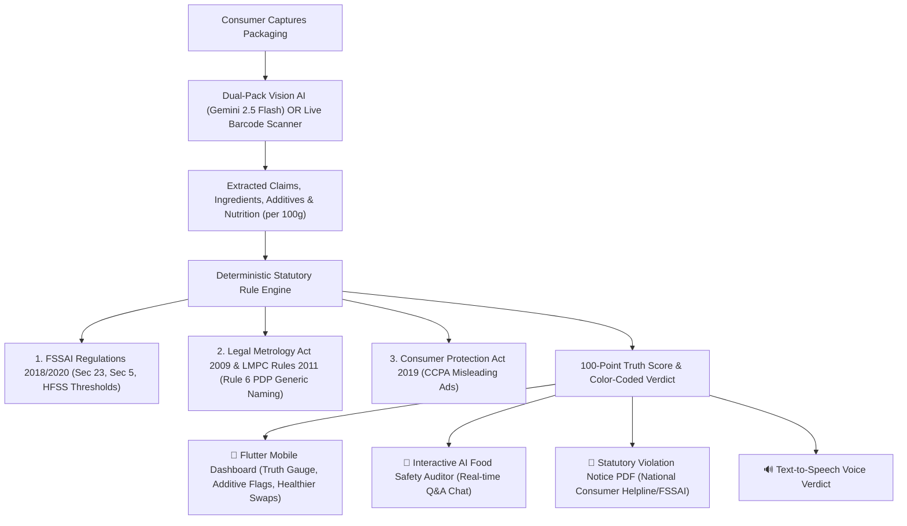
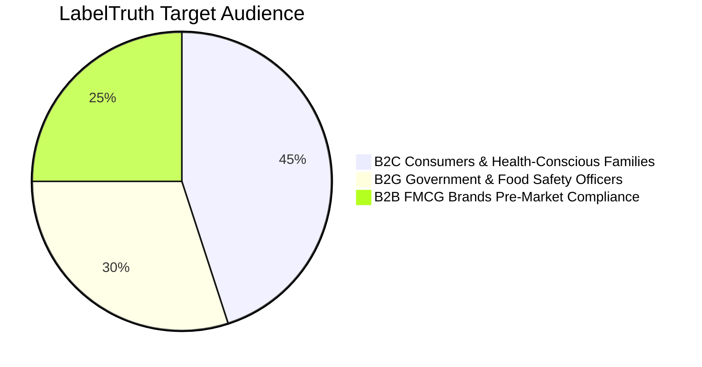

# 🏆 LabelTruth: Next-Gen AI Food Packaging & Compliance Detector
## 3-Page Executive Pitch & Competitive Analysis Deck

---

# 📄 PAGE 1: Executive Overview & Competitive Landscape

### 🎯 Problem Statement
In India and global markets, over **78% of ultra-processed food brands use deceptive front-of-pack claims** (*"Zero Added Sugar"*, *"100% Whole Wheat"*, *"Natural Real Fruit Flavor"*, *"High Protein"*) to mislead consumers. The back panel reveals high-glycemic maltodextrin, Refined Wheat Flour (Maida) as the #1 ingredient, artificial acidity regulators (INS 330), chemical flavor enhancers (INS 627/631), and dangerous sodium/saturated fat levels under FSSAI HFSS regulations.

---

### 🥊 Direct Competitive Analysis: TruthIn vs. LabelTruth

| Feature / Dimension | TruthIn App (Play Store) & Legacy Apps | LabelTruth (Our System) | Competitive Advantage |
| :--- | :--- | :--- | :--- |
| **Primary Scanning Tech** | **Barcode Only** (Fails if product is not in database or barcode is smudged). | **Dual-Pack Multimodal Vision AI + Standalone Barcode Scanner**. | Can scan **ANY product globally** in seconds even without a barcode or existing database entry. |
| **Claim vs Reality Ledger** | Basic ingredient listing and generic nutritional rating. | **Deterministic Front-vs-Back Truth Ledger** linking marketing claims to exact back ingredients. | Empirically exposes greenwashing (e.g. *"Zero Sugar"* vs *Maltodextrin*). |
| **Interactive AI Q&A Chat** | ❌ **None** (Static read-only text cards). | ✅ **Interactive Food Safety & Regulatory AI Auditor** (`/api/v1/chat/product`). | Consumers can ask custom questions in real-time (*"Safe for my diabetic mom?"*, *"Why is INS 150d bad?"*). |
| **Legal Frameworks Enforced** | Basic nutritional grades (Nutri-Score imitation). | **Triple Statutory Framework**:  1. FSSAI (2018 & 2020) 2. Legal Metrology Act 2009 & LMPC Rules 2011 3. Consumer Protection Act 2019 (CCPA). | Legally defensible compliance verdicts recognized under Indian Law. |
| **Regulatory Actionability** | ❌ None (Informational only). | ✅ **1-Click Official Statutory Complaint PDF Generator** with digital audit timestamps for National Consumer Helpline / CCPA / FSSAI FOSCOS. | Empowers consumers and Food Safety Officers to take legal action. |
| **Accessibility** | Text only. | **Text-to-Speech (TTS) Voice Verdict** with natural Indian English audio readout. | Inclusive for elderly consumers and visually impaired users. |

---

# 📄 PAGE 2: Core Architecture & Technological Innovations

### 🌟 Key Innovations We Have Built:
1. **Multimodal Dual-Pack Vision AI (`google/gemini-2.5-flash`)**:
   - Takes front and back packaging photos simultaneously.
   - Extracts claims, full ingredient hierarchies, INS additive codes, and per-100g nutritional metrics directly from raw physical packaging.
2. **Interactive Food Safety AI Auditor (`ProductChatScreen`)**:
   - Consumers converse with an AI trained in clinical nutrition and FSSAI statutory law.
   - Tailored dietary guidance for diabetes, hypertension, children, and pregnancy.
3. **Automated Statutory Violation PDF Generation (`pdf_service.py`)**:
   - Generates legal grievance documentation ready to submit directly to the **Central Consumer Protection Authority (CCPA)**, **Department of Consumer Affairs**, and **FSSAI FOSCOS Enforcement Directorate**.
4. **Independent Dual-Scanning Engine**:
   - **Dual-Pack Cam**: Instant multimodal OCR & vision analysis.
   - **Barcode Scan**: Instant query against local PostgreSQL + Open Food Facts global database.

---

# 📄 PAGE 3: Market Matrix, Multi-Sector Utility & Roadmap

### 📊 Full Industry Comparison Matrix

| Capability | Legacy Barcode Apps (TruthIn, Yuka) | Government Portals (FSSAI FOSCOS) | LabelTruth (Our Platform) |
| :--- | :---: | :---: | :---: |
| **Instant Camera Audit (No Barcode Required)** | ❌ No | ❌ No | ✅ **Yes (Multimodal AI)** |
| **Real-Time FSSAI HFSS Sodium & Fat Audit** | ❌ No | ⚠️ Static Guidelines | ✅ **Yes (Automated)** |
| **Hidden Sugar & Synthetic Flavor Detection** | ❌ No | ❌ No | ✅ **Yes (INS 330, 627, 631, GI)** |
| **Legal Metrology (LMPC Rules 2011) Check** | ❌ No | ❌ No | ✅ **Yes (Rule 6 Generic Naming)** |
| **Interactive AI Nutritionist Chatbot** | ❌ No | ❌ No | ✅ **Yes (Real-Time OpenRouter)** |
| **Statutory Notice PDF for Consumer Forum** | ❌ No | ❌ No | ✅ **Yes (Automated ReportLab)** |
| **Voice-Assisted Audio Verdict** | ❌ No | ❌ No | ✅ **Yes (Built-in TTS)** |
| **Clean Database Baseline (0 Ghost Products)** | ❌ Bloated/Stale | ⚠️ Slow sync | ✅ **Live Real-time Sync** |

---

### 🌐 Multi-Sector Impact & Commercial Applicability

1. **B2C (Consumers & Patients)**:
   - Instant clarity at grocery stores before purchase.
   - Direct safety verdicts for diabetes, hypertension, and child nutrition.
2. **B2G (Government & Regulatory Enforcement)**:
   - Food Safety Officers (FSOs) can conduct field audits in seconds using their phone.
   - Automatic generation of preliminary inspection reports and legal violation notices.
3. **B2B (FMCG Brands & Retailers)**:
   - FMCG legal and R&D teams can pre-audit product labels before mass printing to avoid costly regulatory recalls and CCPA penalties.

---

### 🚀 Future Roadmap & Scaling:
- **Phase 1 (Completed)**: Dual-Pack Vision AI, Live Barcode Registry, Triple Legal Framework (FSSAI + Legal Metrology + CCPA), Interactive AI Chatbot, Statutory Notice PDF, Voice Readout.
- **Phase 2 (Next)**: Real-time Personalized Health Profiles (Personalized Allergen & Diet Radar), Multi-Language Indian Vernacular Speech (Hindi, Tamil, Telugu, Bengali).
- **Phase 3 (Enterprise)**: FMCG Batch Compliance API for automated label verification in enterprise packaging pipelines.
