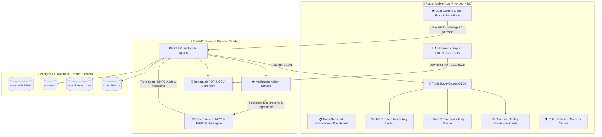

# 🔍 LabelTruth — AI-Powered Automated Legal Metrology & Packaging Compliance Enforcement System

[](https://consumeraffairs.nic.in/)
[](https://www.fssai.gov.in/)
[](https://fastapi.tiangolo.com)
[](https://flutter.dev)
[](https://render.com)
[](https://postgresql.org)

**LabelTruth** is an enterprise-grade mobile and web compliance verification platform engineered for **Department of Consumer Affairs (DoCA) Legal Metrology Officers, Food Safety Officers (FSOs), and consumers** to automate packaging audits under the **Legal Metrology (Packaged Commodities) Rules, 2011 (LMPC Rules)** and **Food Safety and Standards Authority of India (FSSAI)** regulations.

---

## 🌟 Key Features

- **📷 Dual-Camera Split Scan Flow**: Capture Front-of-Pack (marketing claims) and Back-of-Pack (statutory declarations & ingredients) in one synchronized audit session.
- **⚖️ Automated LMPC Rule 6 Mandatory Declarations Audit**: 100% automated verification of all 7 statutory declaration fields:
  1. *Rule 6(1)(a)*: Name & Address of Manufacturer / Packer / Importer.
  2. *Rule 6(1)(b)*: Generic / Common Commodity Identity.
  3. *Rule 6(1)(c)*: Standard Net Quantity in legal metric units (g, kg, ml, l).
  4. *Rule 6(1)(d)*: Date of Manufacture / Packaging & Expiry.
  5. *Rule 6(1)(e)*: Maximum Retail Price (MRP inclusive of all taxes).
  6. *Rule 6(1)(g)*: Consumer Care / Grievance Redressal contact details.
  7. *Rule 6(1)(h)*: Mandatory Unit Sale Price (USP per g/ml).
- **📐 LMPC Rule 7 & Schedule-II Font Size & Readability Engine**: Deterministic mathematical check verifying that numeral and letter heights meet statutory thresholds based on Principal Display Panel (PDP) area and package weight.
- **🎯 Dynamic 0–100 Truth Score Gauge**: Animated radial gauge computing compliance deductions in real-time.
- **📊 Multi-Format Digital Compliance Reports**:
  - 📄 **Statutory Violation Notice (PDF)**: Print-ready formal legal notice for CCPA / DoCA / FSSAI FOSCOS filings.
  - 📊 **Editable Spreadsheet (CSV)**: Tabular format for officer inspection records.
  - 🗂️ **Machine-Readable Audit Docket (JSON)**: Complete data payload for enforcement archives.
- **🛡️ Role-Based Access Control (RBAC)**: Switch between **Enforcement Officer Mode (LMPC / FSSAI Inspector)** with badge credentials & jurisdiction tools, and **Consumer Advocate Mode**.
- **📈 Enforcement & Inspection Monitoring Dashboard**: Live metrics for compliance rates, total inspections, violation category distribution, and enforcement notice readiness.
- **💬 Interactive Regulatory AI Chatbot (`/chat/product`)**: Built-in conversational AI allowing officers and consumers to query specific legal thresholds and health impacts.

---

## 🏛️ System Architecture



---

## ⚖️ Statutory Regulations & Rules Enforced

| Rule Code | Violation Name | Regulation Reference | Detection Logic | Penalty |
| :--- | :--- | :--- | :--- | :--- |
| **RULE_A** | **Zero Sugar Deception** | *FSSAI Claims Reg. 2018 (Sec 5(2))* | "Zero Sugar" claim but contains Maltodextrin (GI 110), Invert Syrup, HFCS, Dextrose | **-30 (Critical)** |
| **RULE_B** | **Grain Hierarchy Inversion** | *FSSAI Labelling Reg. 2020 (Sec 23)* | "100% Whole Wheat" claim but Maida (Refined Flour) is #1 ingredient | **-25 (Critical)** |
| **RULE_C** | **High Protein Shortfall** | *FSSAI Schedule-II (Nutrition Claims)* | "High Protein" claim but protein is < 12% total calories or < 10g/100g | **-15 (High)** |
| **RULE_D** | **Palm Oil Masking** | *FSSAI Sec 2.2.2.5 (Vegetable Fat Specificity)* | Disguises refined palm oil / palmolein under generic "Edible Vegetable Oil" | **-20 (High)** |
| **RULE_E** | **Toxic & Synthetic Additives** | *FSSAI Permitted Food Additives Tables* | Flags Caramel IV (INS 150d / 4-MEI), Sunset Yellow (INS 110), High Sucralose (INS 955) | **-10 to -15** |
| **RULE_F** | **HFSS Sodium & Fat Caps** | *FSSAI Labelling & Display Regulations 2020* | Flags trans fats > 0.2g or sodium > 400mg/100g | **-15 (High)** |
| **RULE_G** | **LMPC Mandatory Declarations** | *LMPC Rules 2011 (Rule 6)* | Audits all 7 mandatory fields: Manufacturer, Generic Name, Net Qty, Dates, MRP, Care, USP | **-15 (High)** |
| **RULE_H** | **Font Size & Readability** | *LMPC Rules 2011 (Rule 7 & Schedule-II)* | Checks minimum numeral height in mm against Principal Display Panel area bracket | **-15 (High)** |

---

## 📁 Repository Structure

```
├── backend/                        # FastAPI Backend & Rule Engine
│   ├── app/
│   │   ├── api/v1/endpoints/       # REST Endpoints (analyze, products, scans, report, users, rules)
│   │   ├── core/                   # Database engine, CORS & Config loader
│   │   ├── models/                 # SQLAlchemy ORM Models (User with RBAC, Product, ScanHistory)
│   │   ├── schemas/                # Pydantic Schemas (LMPC Mandatory Declarations, Font Audit)
│   │   └── services/               # AI Vision, Deterministic Rule Engine, ReportLab PDF & CSV
│   ├── tests/                      # Automated PyTest test suite (7/7 Passing)
│   ├── Dockerfile                  # Container definition for production deployment
│   ├── render.yaml                 # Render Blueprint configuration
│   ├── seed_data.py                # Database seeder with benchmark market foods & Officer profile
│   ├── requirements.txt            # Python dependencies
│   └── DEPLOY_RENDER.md            # Step-by-step Render deployment manual
│
├── labeltruth_app/                 # Flutter Mobile App Client
│   ├── lib/
│   │   ├── core/constants/         # Color palettes & API endpoints
│   │   ├── core/theme/             # Dark theme & Typography tokens
│   │   ├── models/                 # Dart Data Models (ScanResult, LMPC Declarations, FontAudit)
│   │   ├── providers/              # Riverpod State Notifiers (Scan, Settings with RBAC)
│   │   ├── services/               # Dio HTTP client, TTS audio service
│   │   ├── widgets/                # Truth Gauge, Claim Cards, Ingredient Chips, PDF/CSV modal
│   │   └── screens/                # Home, Dual-Capture, Result, History, Settings (RBAC)
│   └── test/                       # Flutter Widget & UI Smoke Tests (Passing)
│
└── .gitignore                      # Clean exclusion of build artifacts & cache
```

---

## 🚀 Getting Started

### 1. Run the Backend Locally
```bash
cd backend
pip install -r requirements.txt
python seed_data.py
uvicorn app.main:app --reload --host 0.0.0.0 --port 8000
```
- Interactive API Docs: `http://localhost:8000/docs`
- Health Check: `http://localhost:8000/health`

### 2. Run the Flutter Mobile App
```bash
cd labeltruth_app
flutter pub get
flutter run
```

### 3. Deploy to Render Cloud
Follow the complete guide in [`backend/DEPLOY_RENDER.md`](backend/DEPLOY_RENDER.md) or deploy using Render Blueprint via `backend/render.yaml`.
