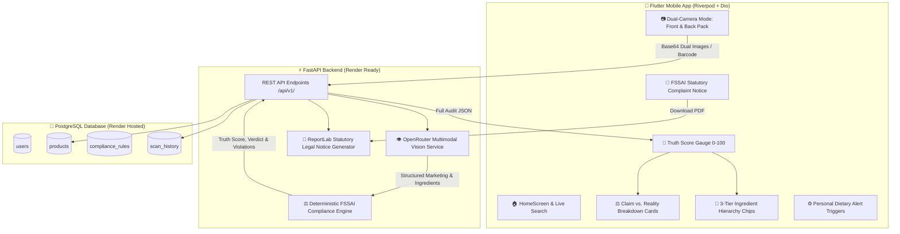

# 🔍 LabelTruth — AI-Powered Misleading Food Packaging & Compliance Detector

[](https://www.fssai.gov.in/)
[](https://fastapi.tiangolo.com)
[](https://flutter.dev)
[](https://render.com)
[](https://postgresql.org)

**LabelTruth** is a full-stack, production-ready mobile application and compliance engine designed to empower consumers and regulatory bodies by exposing misleading front-of-pack food marketing claims against empirical back-panel ingredient hierarchies and nutritional facts under **FSSAI** (Food Safety and Standards Authority of India) and **CCPA** (Central Consumer Protection Authority) regulations.

---

## 🌟 Key Features

- **📷 Dual-Camera Split Scan Flow**: Capture Front-of-Pack (marketing claims) and Back-of-Pack (ingredients and nutrition facts) in one synchronized audit session.
- **🎯 Dynamic 0–100 Truth Score Gauge**: Animated radial sweep-gradient gauge computing compliance deductions in real-time.
- **⚖️ Claim vs. Reality Comparative Cards**: Direct side-by-side contrast between marketing slogans and laboratory findings.
- **🧪 3-Tier Ingredient Hierarchy**: Color-coded chips (🟢 Clean, 🟡 Warning / Refined Flour, 🔴 Harmful / Palm Oil / Synthetic Additives).
- **📑 Statutory FSSAI Legal Notice (PDF)**: Generates print-ready formal consumer grievance notices for filing on CCPA & FSSAI FOSCOS portals.
- **⚙️ Personal Dietary & Allergen Triggers**: Instant alerts for Palm Oil, Diabetic/Glycemic Index, Low Sodium, Strict Vegan verification, and 8+ major allergens.
- **🧪 Preloaded Benchmark Test Suite**: Test immediate audit scenarios with 4 realistic benchmark market foods.

---

## 🏛️ System Architecture



---

## ⚖️ FSSAI Regulatory Rules Enforced

| Rule ID | Violation Name | Regulation Reference | Detection Logic | Penalty |
| :--- | :--- | :--- | :--- | :--- |
| **RULE_A** | **Zero Sugar Deception** | *FSSAI Claims & Adv. Reg. 2018 (Sec 5(2))* | "Zero Sugar" claim but contains Maltodextrin (GI 110), Invert Syrup, HFCS, Dextrose | **-30 (Critical)** |
| **RULE_B** | **Grain Hierarchy Deception** | *FSSAI Labelling Reg. 2020 (Sec 23)* | "100% Atta / Whole Wheat" claim but Maida (Refined Flour) is #1 ingredient | **-25 (Critical)** |
| **RULE_C** | **High Protein Shortfall** | *FSSAI Schedule-II (Nutrition Claims)* | "High Protein" claim but protein is < 12% total calories or < 10g/100g | **-15 (High)** |
| **RULE_D** | **Palm Oil Masking** | *FSSAI Sec 2.2.2.5 (Vegetable Fat Specificity)* | Disguises refined palm oil / palmolein under generic "Edible Vegetable Oil" | **-20 (High)** |
| **RULE_E** | **Toxic & Synthetic Additives** | *FSSAI Permitted Food Additives Tables* | Flags Caramel IV (INS 150d / 4-MEI), Sunset Yellow (INS 110), High Sucralose (INS 955) | **-10 to -15** |
| **RULE_F** | **Sodium & Trans Fat Thresholds** | *FSSAI Nutritional Declaration Norms* | Flags trans fats > 0.2g or sodium > 400mg/100g | **-10 (Medium)** |

---

## 📁 Repository Structure

```
├── backend/                        # FastAPI Backend & Rule Engine
│   ├── app/
│   │   ├── api/v1/endpoints/       # REST Endpoints (analyze, products, scans, report, rules)
│   │   ├── core/                   # Database engine, CORS & Config loader
│   │   ├── models/                 # SQLAlchemy ORM Models (User, Product, ScanHistory, Rule)
│   │   ├── schemas/                # Pydantic Schemas & Validators
│   │   └── services/               # AI Vision, Rule Engine & ReportLab PDF Generator
│   ├── tests/                      # Automated PyTest test suite (5/5 Passing)
│   ├── Dockerfile                  # Container definition for production deployment
│   ├── render.yaml                 # Render Blueprint configuration
│   ├── seed_data.py                # Database seeder with benchmark market foods
│   ├── requirements.txt            # Python dependencies
│   └── DEPLOY_RENDER.md            # Step-by-step Render deployment manual
│
├── labeltruth_app/                 # Flutter Mobile App Client
│   ├── lib/
│   │   ├── core/constants/         # Color palettes & API endpoints
│   │   ├── core/theme/             # Dark theme & Typography tokens
│   │   ├── models/                 # Dart Data Models (ScanResult, ClaimComparison, etc.)
│   │   ├── providers/              # Riverpod State Notifiers (Scan, Settings)
│   │   ├── services/               # Dio HTTP client & fallback service
│   │   ├── widgets/                # Truth Gauge, Claim Cards, Ingredient Chips, PDF modal
│   │   └── screens/                # Home, Dual-Capture, Result, History, Settings
│   └── test/                       # Flutter Widget & UI Smoke Tests (Passing)
│
└── .gitignore                      # Clean exclusion of build artifacts & cache
```

---

## 🚀 Getting Started

### 1. Run the Backend Locally
```bash
cd backend
pip install -r requirements.txt
python seed_data.py
uvicorn app.main:app --reload --host 0.0.0.0 --port 8000
```
- Interactive API Docs: `http://localhost:8000/docs`
- Health Check: `http://localhost:8000/health`

### 2. Run the Flutter Mobile App
```bash
cd labeltruth_app
flutter pub get
flutter run
```

### 3. Deploy to Render Cloud
Follow the complete guide in [`backend/DEPLOY_RENDER.md`](backend/DEPLOY_RENDER.md) or deploy using Render Blueprint via `backend/render.yaml`.
